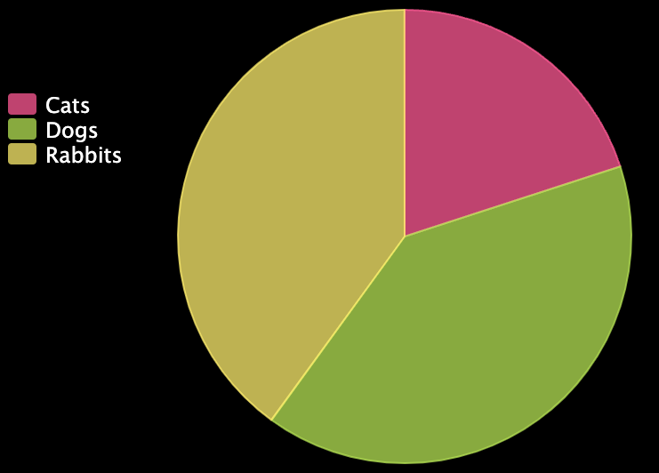

The pygal library allows you to create interactive charts from data.

--- code ---
---
language: python
filename: main.py
line_numbers: false
---
from pygal import *
--- /code ---

To create a chart with pygal, you need to use one of the functions provided by the library:
 - `Bar()` will create a bar or column chart
 - `Pie()` will create a pie chart

--- code ---
---
language: python
filename: main.py
line_numbers: false
---
chart = Pie()
--- /code ---

You then need to add some data to the chart using the `add()` function of your chart:

--- code ---
---
language: python
filename: main.py
line_numbers: false
---
chart.add(item, value)
--- /code ---

Where:
 - `item` is a string — it might be a country, a person, a type of car, etc.
 - `value` is the number you want to display related to `item`

Finally, you need to call the `render()` function of your chart to display it.

For example:

--- code ---
---
language: python
filename: main.py
line_numbers: false
---
from pygal import Pie
# Create a Pie chart
chart = Pie()
# Add some data
chart.add('Cats', 5)
chart.add('Dogs', 10)
chart.add('Rabbits', 10)
# Display the chart
chart.render()
--- /code ---

{:width="200px"}

