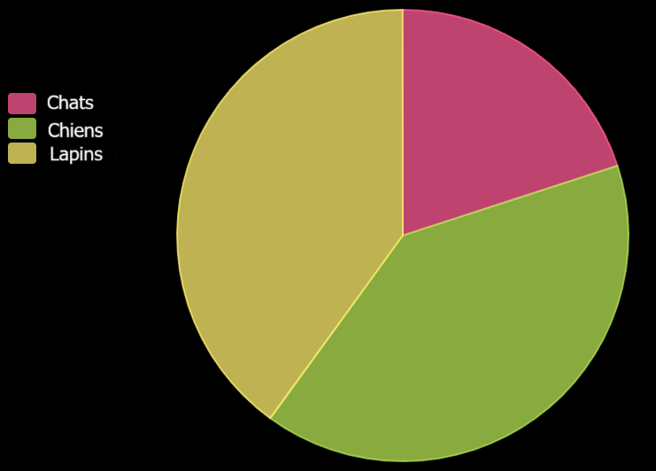

La bibliothèque pygal te permet de créer des graphiques interactifs à partir de données.

```python
from pygal import *
```

Pour créer un graphique avec pygal, tu dois utiliser l'une des fonctions fournies par la bibliothèque :
 - `Bar()` crée un histogramme
 - `Pie()` crée un camembert

```python
graphique = Pie()
```

Tu dois ensuite ajouter quelques données au graphique en utilisant la fonction `add()` pour ton graphique :

```python
graphique.add(élément, valeur)
```

Où :
 - `élément` est une chaîne de caractères — il peut s'agir d'un pays, d'une personne, d'un type de voiture, etc.
 - `valeur` est un nombre lié à `élément`

Pour finir, tu dois appeler la fonction `render()` pour ton graphique afin de l'afficher.

Par exemple :

```python
from pygal import Pie
# Créer un camembert
graphique = Pie()
# Ajouter des données
graphique.add('Chats', 5)
graphique.add('Chiens', 10)
graphique.add('Lapins', 10)
# Afficher le graphique
graphique.render()
```




