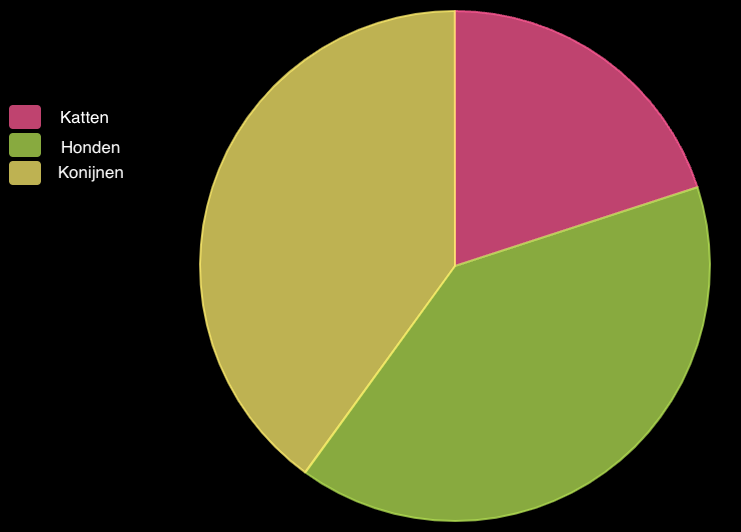

Met de pygal bibliotheek kun je interactieve grafieken van gegevens maken.

```python
from pygal import *
```

Om een grafiek met pygal te maken moet je een van de functies van de bibliotheek gebruiken:
 - `Bar()` maakt een staafdiagram
 - `Pie()` maakt een taartdiagram

```python
chart = Pie()
```

Vervolgens moet je enkele gegevens aan de grafiek toevoegen met behulp van de `add()` functie van je grafiek:

```python
chart.add(item, value)
```

Waarbij:
 - `item` is een string — het kan een land, een persoon, een type auto, enz. zijn.
 - `waarde` is een getal gerelateerd aan `item`

Tot slot moet je de `render()` functie van je grafiek aanroepen om deze weer te geven.

Bijvoorbeeld:

```python
from pygal import Pie
# Create a Pie chart
chart = Pie()
# Add some data
chart.add('Cats', 5)
chart.add('Dogs', 10)
chart.add('Rabbits', 10)
# Display the chart
chart.render()
```




